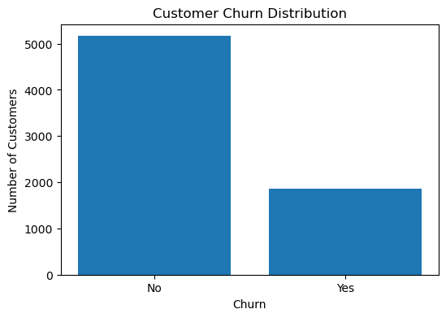
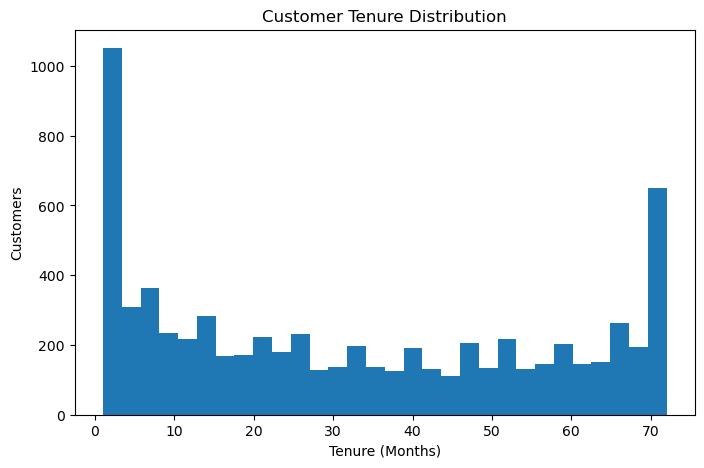

# 📊 Customer Churn Analysis using Machine Learning

## 📌 Project Overview

Customer churn is one of the biggest challenges for subscription-based businesses. This project uses Machine Learning to predict whether a customer is likely to leave (churn) based on demographic, account, and service-related information.

The project includes data preprocessing, exploratory data analysis (EDA), feature engineering, model building using Logistic Regression, and evaluation with multiple performance metrics.

---

## 🎯 Objectives

- Analyze customer behavior and churn patterns.
- Identify the key factors influencing customer churn.
- Build a Machine Learning model to predict churn.
- Provide business insights to improve customer retention.

---

## 📂 Dataset

- **Dataset:** Telco Customer Churn Dataset
- **Records:** 7,032 customers
- **Features:** 21

The dataset contains customer information such as:

- Gender
- Senior Citizen
- Partner
- Dependents
- Tenure
- Internet Service
- Contract Type
- Payment Method
- Monthly Charges
- Total Charges
- Churn Status

---

## 🛠 Technologies Used

- Python
- Pandas
- NumPy
- Matplotlib
- Scikit-learn
- Jupyter Notebook

---

## 📈 Exploratory Data Analysis

The following analyses were performed:

- Customer Churn Distribution
- Customer Tenure Distribution
- Monthly Charges Distribution
- Data Cleaning
- Missing Value Analysis
- Feature Encoding

---

## 🤖 Machine Learning Model

Model Used:

- Logistic Regression

Steps:

- Data Preprocessing
- Label Encoding
- Train-Test Split
- Model Training
- Prediction
- Model Evaluation

---

## 📊 Model Performance

| Metric | Score |
|---------|--------|
| Accuracy | **79%** |
| Precision | **62%** |
| Recall | **56%** |
| F1 Score | **59%** |

---

## ⭐ Top Features Affecting Customer Churn

- Tenure
- Monthly Charges
- Contract Type
- Total Charges
- Phone Service
- Online Security
- Tech Support
- Internet Service
- Paperless Billing
- Online Backup

---

## 💡 Business Insights

- Customers with shorter tenure are more likely to churn.
- High monthly charges increase churn probability.
- Customers on month-to-month contracts are at higher risk.
- Customers without Online Security and Tech Support are more likely to leave.
- Offering long-term contracts and additional services can improve customer retention.

---

## 📷 Project Visualizations

### Customer Churn Distribution



---

### Customer Tenure Distribution



---

### Feature Importance


---

### Confusion Matrix


---

### ROC Curve


---

## 📁 Project Structure

```
Customer-Churn-Analysis
│
├── data
│   └── Telco-Customer-Churn.csv
│
├── notebooks
│   └── Customer_Churn_Analysis.ipynb
│
├── images
│   ├── churn_distribution.png
│   ├── tenure_distribution.png
│   ├── feature_importance.png
│   ├── confusion_matrix.png
│   └── roc_curve.png
│
├── requirements.txt
├── README.md
├── LICENSE
└── .gitignore
```

---

## 🚀 How to Run the Project

1. Clone the repository

```bash
git clone https://github.com/Bamani07/Customer-Churn-Analysis.git
```

2. Navigate to the project folder

```bash
cd Customer-Churn-Analysis
```

3. Install dependencies

```bash
pip install -r requirements.txt
```

4. Open the notebook

```bash
jupyter notebook
```

Open:

```
Customer_Churn_Analysis.ipynb
```

---

## 👨‍💻 Author

**Mohsin Bamani**

- GitHub: https://github.com/Bamani07
- LinkedIn: https://www.linkedin.com/in/mohsin-bamani

---

## ⭐ If you found this project useful, consider giving it a star!
